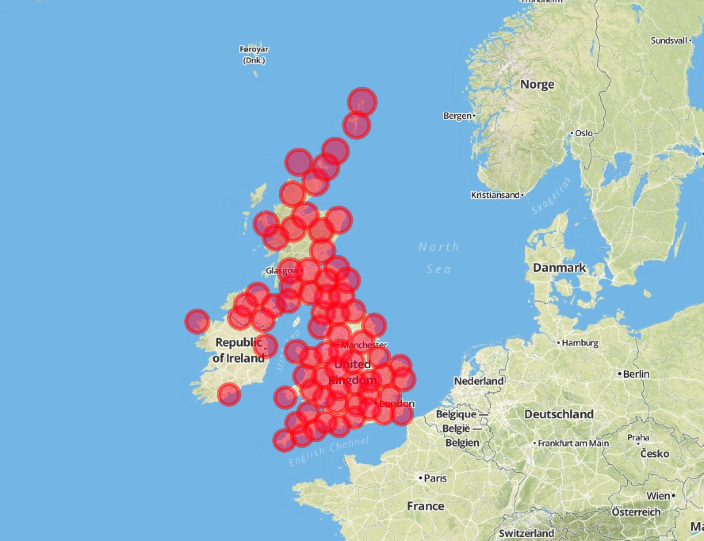

BADC Weather Station Data Extractor
====================================

The British Atmospheric Data Centre (BADC)'s weather data extraction script. (http://badc.nerc.ac.uk/home/index.html) Extracts information from their database fetching station codes and links to download the data for year range.

Usage

	./extractor.py <year from which data is needed> <distance clustering is required>

For example:

		./extractor.py 1985 50
		
The end result is a map with clustered data from which station can also be selected.

